# AMIVRE Backend - Mermaid Architecture & Workflow Diagrams

## 1. Complete User Journey & Data Flow

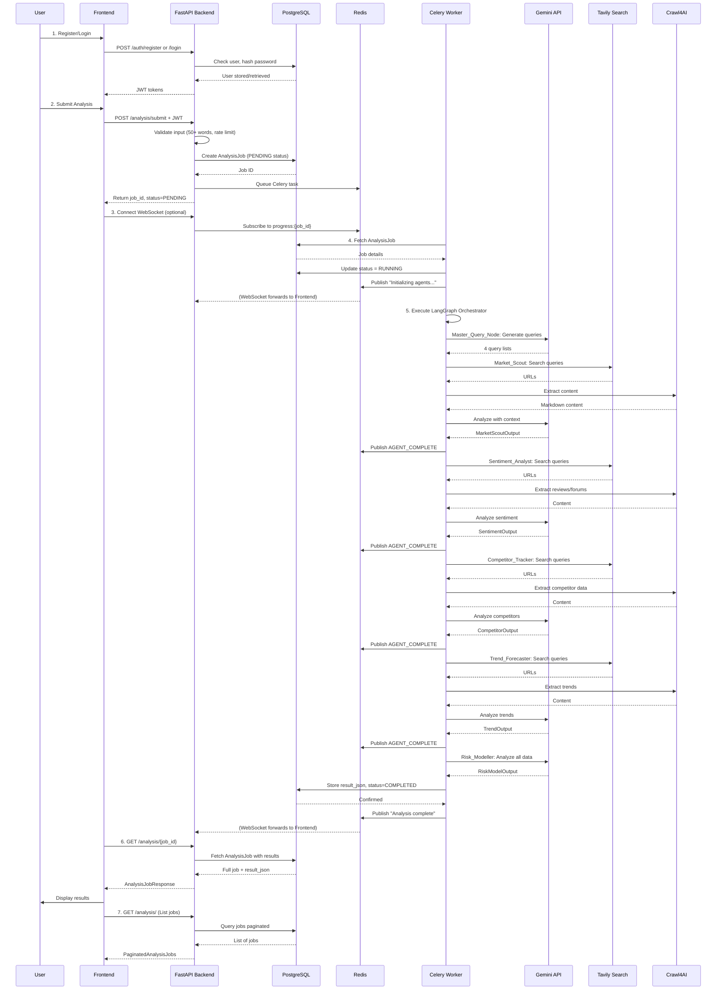

---

## 2. LangGraph Orchestrator Workflow

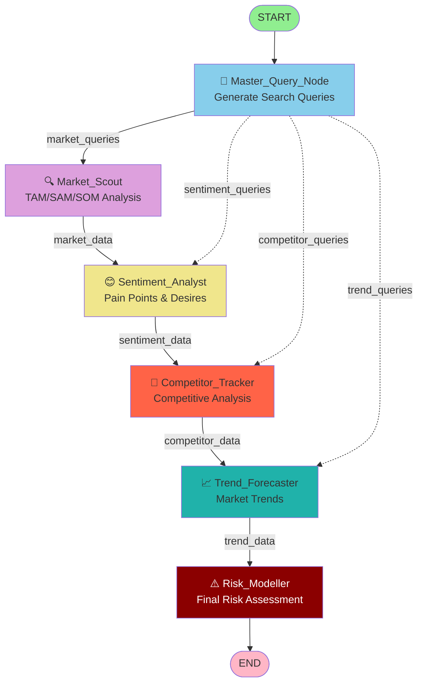

---

## 3. Data Flow Between Components

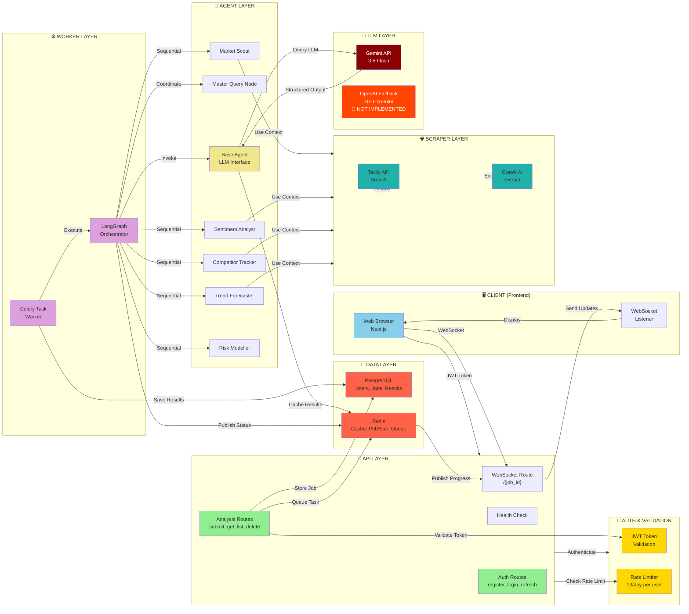

---

## 4. Agent Execution Pipeline (Detailed)

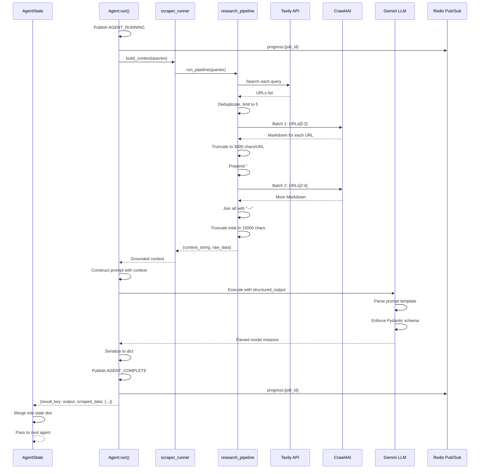

---

## 5. Database Schema

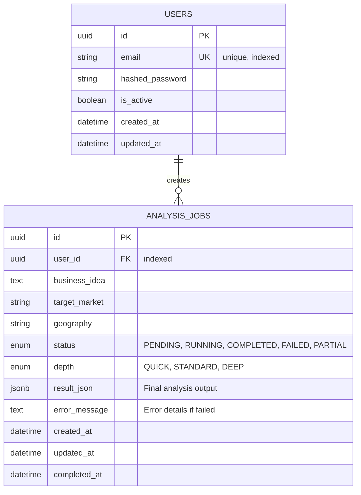

---

## 6. API Endpoint Map

```mermaid
graph TD
    API["📡 /api/v1"]
    
    AUTH["🔐 /auth"]
    ANALYSIS["📊 /analysis"]
    HEALTH["💚 /health"]
    WS["🔌 /ws"]
    
    API --> AUTH
    API --> ANALYSIS
    API --> HEALTH
    API --> WS
    
    AUTH --> AR["POST /register<br/>Input: UserCreate<br/>Output: user_id"]
    AUTH --> AL["POST /login<br/>Input: OAuth2 Form<br/>Output: Token"]
    AUTH --> AREF["POST /refresh<br/>Input: refresh_token<br/>Output: Token"]
    AUTH --> AME["GET /me<br/>Input: JWT<br/>Output: UserResponse"]
    
    ANALYSIS --> ASUB["POST /submit<br/>Input: AnalysisSubmitRequest<br/>Output: job_id, status<br/>Rate Limit: 10/day"]
    ANALYSIS --> AGET["GET /{job_id}<br/>Input: JWT, job_id<br/>Output: AnalysisJobResponse"]
    ANALYSIS --> ALIST["GET /<br/>Input: JWT, page, limit, status<br/>Output: PaginatedAnalysisJobs"]
    ANALYSIS --> ADEL["DELETE /{job_id}<br/>Input: JWT, job_id<br/>Output: 204 No Content"]
    
    HEALTH --> HC["GET<br/>Output: {status, version}"]
    
    WS --> WSPROG["WS /{job_id}<br/>Input: JWT, job_id<br/>Output: Progress events"]
    
    style API fill:#87CEEB,color:#000
    style AUTH fill:#90EE90
    style ANALYSIS fill:#90EE90
    style HEALTH fill:#90EE90
    style WS fill:#90EE90
    
    style AR fill:#FFD700
    style AL fill:#FFD700
    style AREF fill:#FFD700
    style AME fill:#FFD700
    
    style ASUB fill:#FFA07A
    style AGET fill:#FFA07A
    style ALIST fill:#FFA07A
    style ADEL fill:#FFA07A
    
    style HC fill:#98FB98
    style WSPROG fill:#87CEEB
```

---

## 7. Dependency Injection Flow

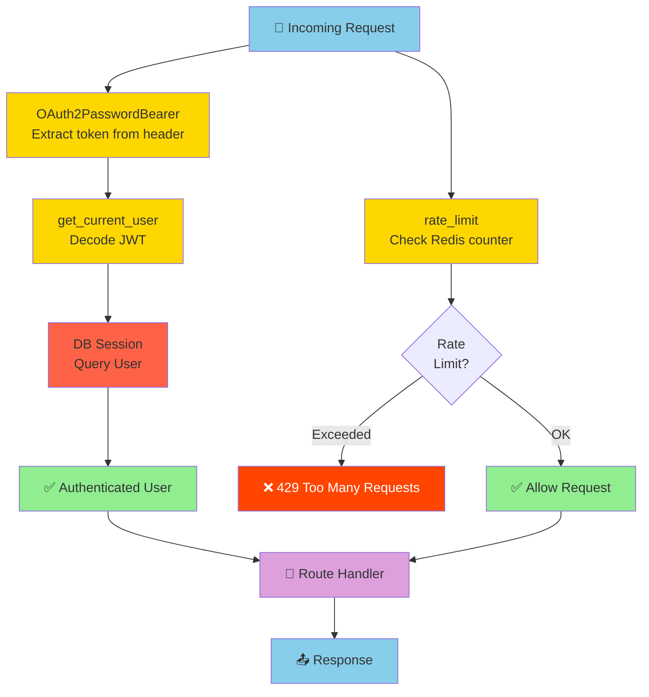

---

## 8. Error Handling & Recovery Paths

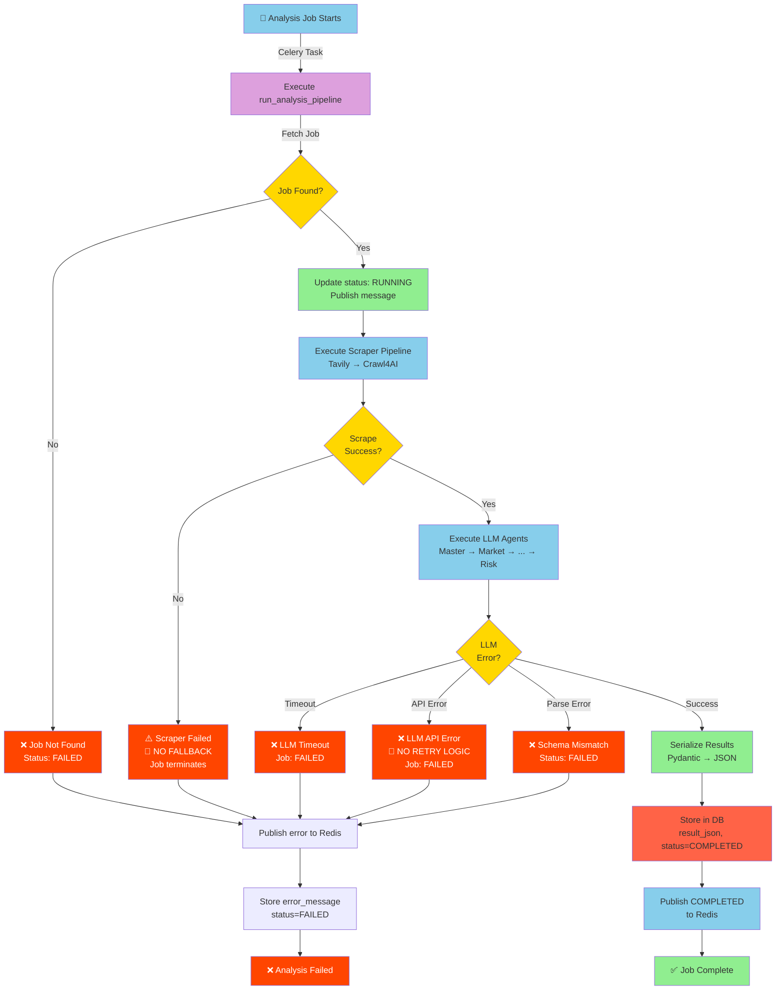

---

## 9. Sequential Agent Execution Timeline

```mermaid
timeline
    title Analysis Job Timeline (Sequential Agents)
    
    section Startup
        00:00 : Job Submitted
        00:05 : Celery Worker Picked Up
        00:15 : Master Query Node Generates Queries
    
    section Agent Execution
        01:00 : Market_Scout Starts (Tavily, Crawl4AI, Gemini)
        04:00 : Market_Scout Complete → Sentiment_Analyst Starts
        07:00 : Sentiment_Analyst Complete → Competitor_Tracker Starts
        10:00 : Competitor_Tracker Complete → Trend_Forecaster Starts
        13:00 : Trend_Forecaster Complete → Risk_Modeller Starts
        15:00 : Risk_Modeller Complete
    
    section Completion
        15:30 : Results Stored in DB
        15:45 : Status = COMPLETED, Redis Published
        16:00 : User Receives Results
        
        section Potential Bottlenecks
        01:00-04:00 : Market Scout (3 min) - Scraper
        04:00-07:00 : Sentiment Analyst (3 min) - Scraper
        10:00-13:00 : Competitor Tracker (3 min) - Scraper
        13:00-15:00 : Risk Modeller (2 min) - LLM only
```

---

## 10. Request Validation Pipeline

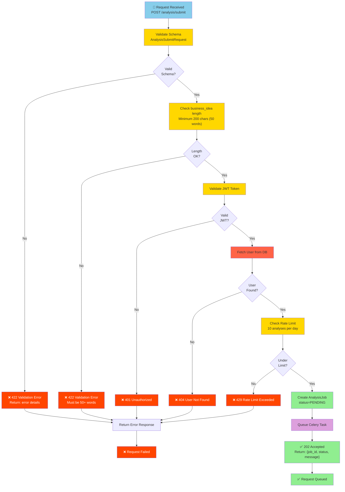

---

## 11. WebSocket Progress Broadcasting

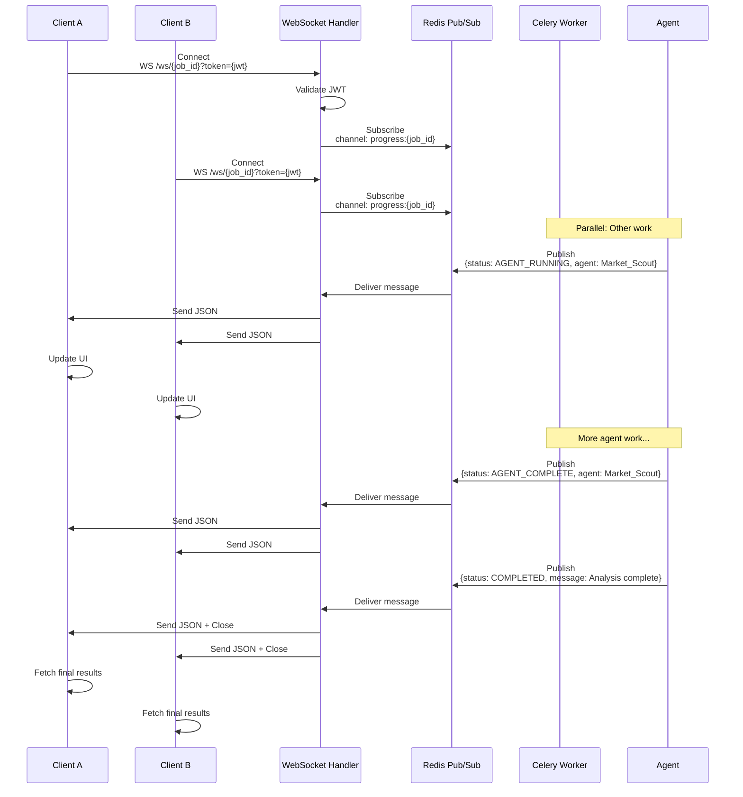

---

## 12. Security & Authentication Flow

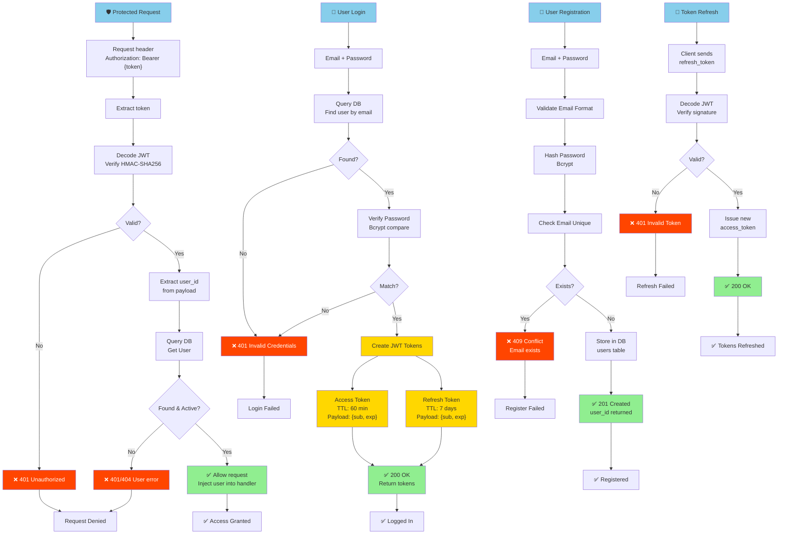

---

## Key Observations from These Diagrams:

1. **Sequential bottleneck**: Agents run one-at-a-time, each taking 3+ minutes (diagram 9)
2. **No error recovery**: Scraper failures terminate job immediately (diagram 8)
3. **Multiple clients can listen**: WebSocket broadcasts to all connected clients (diagram 11)
4. **Rate limiting applies per-user, not per-IP**: Account creation bypass possible (diagram 12)
5. **LLM entirely depends on Gemini**: No fallback implementation (diagram 3)

